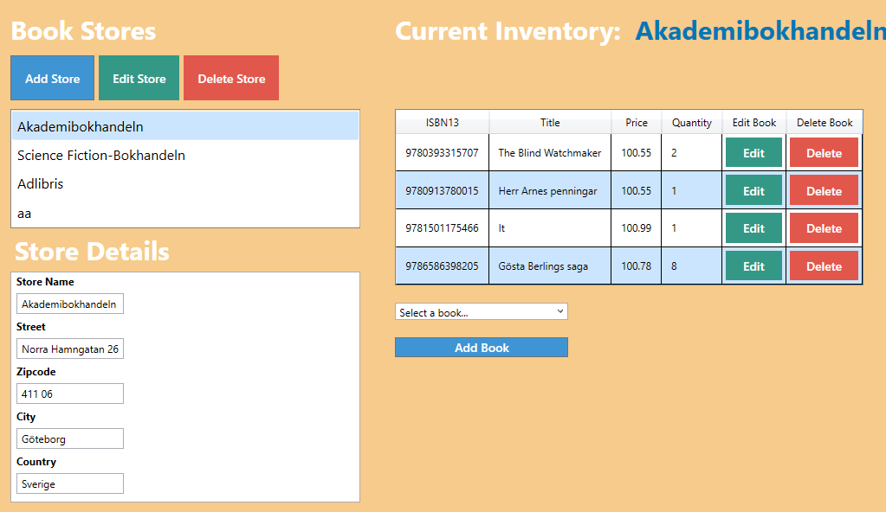

# Schoolproject - BookStore Management

## About
This is an app for management of bookstores. The program allows you to Add, Edit and Remove bookstores aswell as Add books from a list, Edit books and remove books from the stores.

## Improvements
**Improvements to be made**: Add books and Authors to the list.

## Technology Stack
- C#
- WPF
- Entity Framework
- SQL Server

## Prerequisites
- Visual Studio
- SQL Server

## Restore Database
Download and Restore BookStore.bak

## Repository
Clone the repository - git@github.com:Mickenyfiken/Labb02_BookStore.git 

## How it works
start Labb02_BookStore.

Able to choose the store you want to edit.

After selecting a store, you are able to see and edit the books in the inventory.

If you want to edit (or add) a store you will get this to fill in or change the values.

Similar to edit store, you are able to edit the books.

